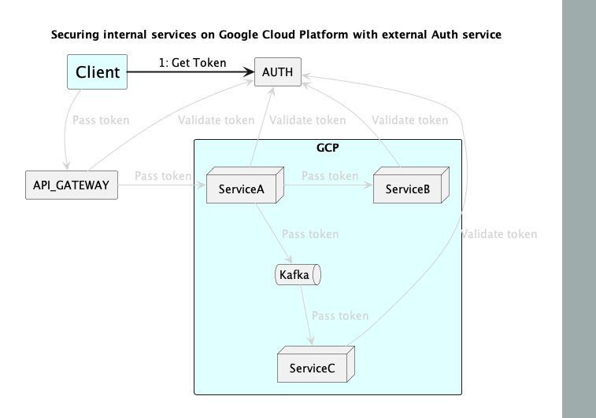

# PlantUML Animation

[](https://pypi.python.org/pypi/animate-puml/)
[](https://pypi.python.org/pypi/animate-puml/)
[](https://pypi.python.org/pypi/animate-puml/)

Simple animation for PlantUML diagrams.



---

**Documentation**: [https://namuan.github.io/animate-puml](https://namuan.github.io/animate-puml)

**Source Code**: [https://github.com/namuan/animate-puml](https://github.com/namuan/animate-puml)

**PyPI**: [https://pypi.org/project/animate-puml/](https://pypi.org/project/animate-puml/)

---

## Pre-requisites

- [PlantUML](https://plantuml.com/)

## Installation

```sh
pip install animate-puml
```

## Example Usage

## Acknowledgements

- [PlantUML](https://plantuml.com/)

## Development

* Clone this repository
* Requirements:
  * Python 3.7+
  * [Poetry](https://python-poetry.org/)

* Create a virtual environment and install the dependencies
```sh
poetry install
```

* Activate the virtual environment
```sh
poetry shell
```

### Validating build
```sh
make build
```

### Release process
A release is automatically published when a new version is bumped using `make bump`.
See `.github/workflows/build.yml` for more details.
Once the release is published, `.github/workflows/publish.yml` will automatically publish it to PyPI.

### Disclaimer

This project is not affiliated with PlantUML.
